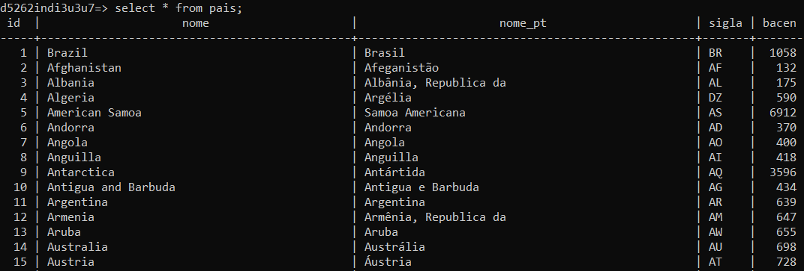
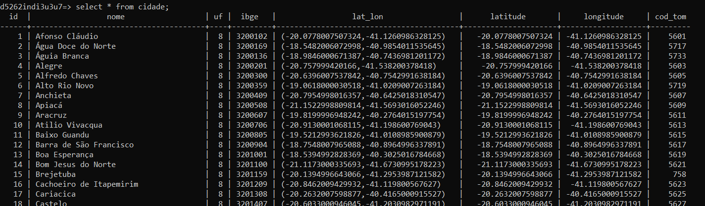
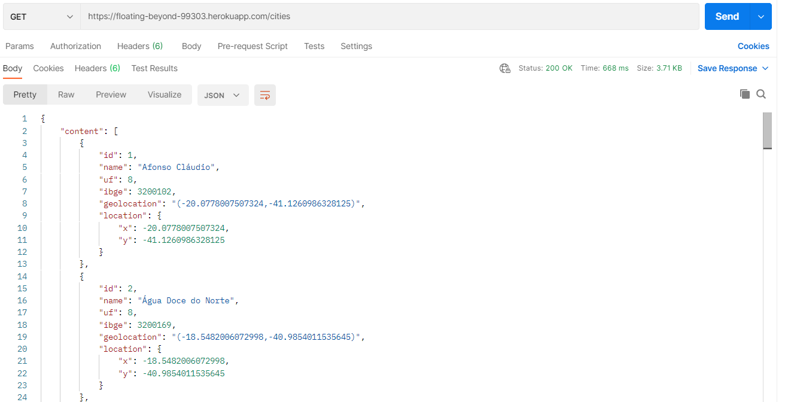
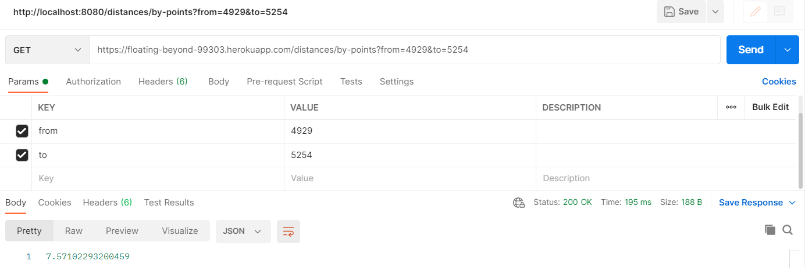
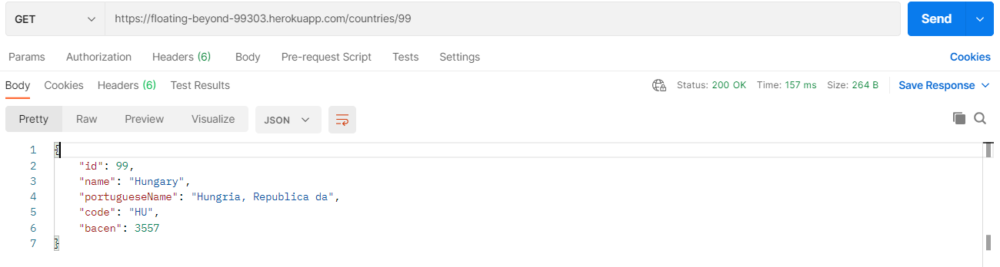

# Cities API

A Spring API that retrieves information about latitude and longitude of countries and brazilian cities and states, and calculates the distance between two cities.

This project was developed based on the [everis](https://www.everis.com) Quality Assurance Beginner bootcamp, provided by [Digital Innovation One](https://digitalinnovation.one/), lasting 44 hours.

This is the [git repository of the course](https://github.com/andrelugomes/digital-innovation-one/tree/master/cities-api), and this is the [git repository of the dataset](https://github.com/chinnonsantos/sql-paises-estados-cidades/tree/master/PostgreSQL).

## GOALS
- Develop a Rest API with Spring and PostgreSQL.
- Use Docker for the application.
- Deploy in Heroku.

## HOW IT LOOKS

This is the result of a SQL query for all the countries.
```
select * from pais;
```


And this is the result from the API.
```
https://floating-beyond-99303.herokuapp.com/countries
```


This is the result of a SQL query for all the cities.
```
select * from cidade;
```


And this is the result from the API.
```
https://floating-beyond-99303.herokuapp.com/cities
```


You can also calculate the distance in miles between two cities, inserting its IDs.
```
https://floating-beyond-99303.herokuapp.com/distances/by-points?from=4929&to=5254
```


And get the information about a specific country.
```
https://floating-beyond-99303.herokuapp.com/countries/99
```

